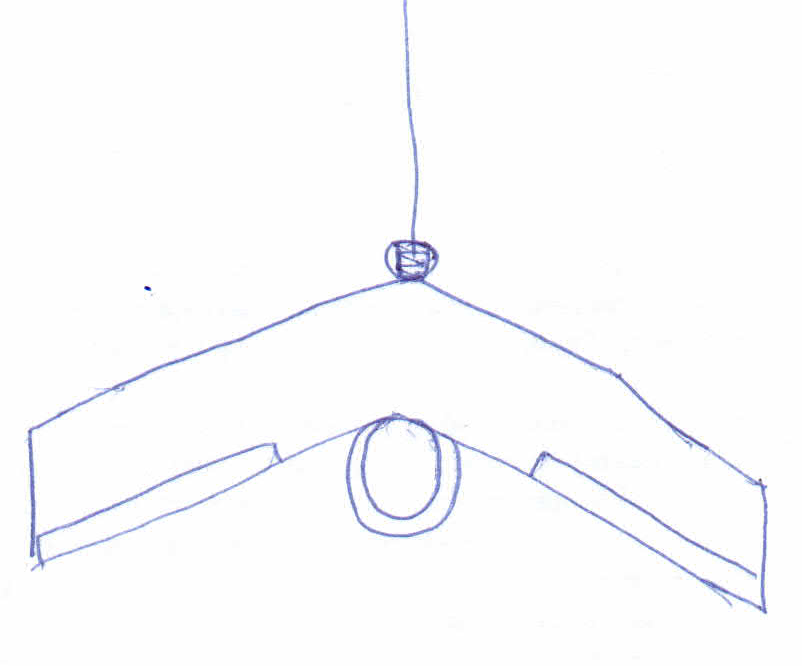
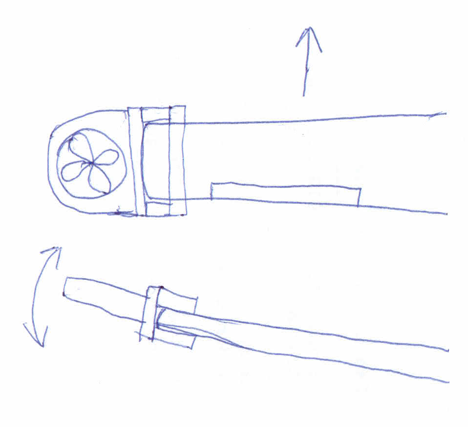

# TF-AEROTOW01 - Idea of technology to towing Gliders with Autonomous Aircraft

In the operation of gliders at sporting or recreational airfields, gliders are transported to the essential altitude either by aerotowing or by a ground winch. Both methods have a significant number of disadvantages.

### Conventional Towing Methods

In the winch case, it's the limited height to which the aircraft can be transported, and the glider is more stressed because the pull is not perpendicular to the lift. Furthermore, this method of towing is relatively risky and requires extensive personnel.

The situation is slightly better for aerotowing as it's not limited by duration and is also more variable. Its primary disadvantage, however, is the relatively high cost. This is caused by the operational and maintenance costs of the tow plane (fuel consumption and especially the hourly rate of the tow plane).

As a result, the cost of aerotowing has been rising. Therefore, unlike in the past, gliders are practically never towed after landing from a field, and transfers between airports are minimized.

### Unmanned Towing of Gliders

The solution to most of these problems would be an automated aerotow, realized by a [UAV](https://en.wikipedia.org/wiki/Unmanned_aerial_vehicle) equipped with sufficient power to tow a glider (comfortably more than 100kW and realistically at least 36kW). Removing the pilot from the cockpit also significantly reduces the weight of the aircraft and thus fuel consumption. Overall, this concept offers several advantages:

- Lower maintenance costs.
- Reduced operating costs.
- Potential reduction in flight time.
- Elimination of combustion engine start-up issues in extreme temperatures.
- Ability to take off from short tracks.
- Reduced inhalation of fumes by the glider crew ([Avgas 100LL contains 0.56 g of lead per liter](https://en.wikipedia.org/wiki/Avgas)).
- Reduced noise pollution at airports.
- Lower environmental impact.

#### Towing at the Airfield

For airport use, the automatic aerotow would mostly fly along a predetermined trajectory, towing the glider until the crew disconnects. This base function could evolve, with subsequent versions possibly using search algorithms or equipment like a thermal radar to find rising thermal currents. However, this requires a more complex technical solution.

#### Towing from Alternative Landings

Even experienced glider pilots occasionally miss their landing at the target airport during cross-country flights. The solution is either to disassemble the glider and transport it back to the airport or (if conditions allow) to use a powered aircraft to take off with the glider in tow. The use of powered aircraft is significantly more convenient, but this option is rarely used due to the cost of the tow plane's independent flight.

In addition, in some cases, the size of the area, which would not be sufficient for the safe start of both aircraft, can prevent this aerotow mode. With the currently used technology, the longest takeoff is for the towing aircraft, which has significantly worse aerodynamic properties than a glider. In general, the parameters of powered aircraft are not very optimized for towing of gliders, and the working points in the flight envelope of both aircraft have significantly different parameters in aerotowing. This leads, among other things, to the need for a long take-off runway, to increased consumption of fuel due to sub-optimal loading, etc. At the same time, it is currently possible to design an aircraft designed and with its parameters optimized for use in aerofoil. It is also likely that an aircraft designed in this way will have a lower purchase price and mainly operating costs than the Zlín aircraft often used today with a power of approximately 134 kW.

In addition to sports use, this mode also has the option of transporting cargo. Because a towed aircraft does not have to be a manned aircraft at all, but can easily transport goods between logistics hubs where other means of transport are complicated.

#### In-flight Towing

Another possible use for precise automated aircraft is the initiation of aerotowing already at a safe altitude. In-flight towing would be a completely new application for unmanned vehicles, not achievable by conventional aircraft.

In this case, instead of the standard tow ring, a towing attachment would be fitted, which would contain an identification target and a hook for the tow rope.

The tow rope from the towing drone would then be fitted with a semi-automatic delta wing with controllable flaps. The towing rope adjusted in this way would allow gentle manipulation of the towing eye and its insertion into the hook on the attachment even during flight. Subsequently, the glider could be towed again without landing. The additional attachment on the towing device also increases the safety of the entire system, as the glider pilot does not lose the opportunity to disconnect from the towing aircraft at any time.

### Construction of an Unmanned Aerotow

Apart from the ground control station, which is not significantly different from the standard concept used for UAVs, several specifics are related to the flight mode.

#### Aerotow Aircraft

The aircraft designed for aerotowing should have specific parameters similar to the towed glider, for example, a low takeoff speed, equal glide ratio, etc. There's also the possibility of using an electric motor, a technology that has already been [practically tested](https://electrek.co/2017/04/04/all-electric-plane-record-top-speed/).

There are several earlier aircraft designs that have interesting properties for aerotowing:

- [Alexander Lippisch's Aerodyne](https://www.reddit.com/r/aviation/comments/68ntd4/alexander_lippischs_aerodyne_a_wingless/) - Enclosed propellers, high safety, and vertical takeoff capability.
- [Edgley Optica](https://en.wikipedia.org/wiki/Edgley_Optica) - An enclosed power unit with a large diameter likely resulting in higher efficiency at low speeds.
- [Nemeth Parasol](https://en.wikipedia.org/wiki/Nemeth_Parasol) - Circular wing with a high stall angle, resulting in high safety as it is almost impossible for such an aircraft to get "hung" by a towed glider.
- [Vought V-173](https://en.wikipedia.org/wiki/Vought_V-173) - Similar advantages as the previous circular wing but more efficient due to large propeller diameters, which also eliminate induced drag on the wing edge.

However, none of these designs is suitable for direct use. It would be more advantageous to modify construction to better suit unmanned means, making it a combination of these alternative solutions.

### Auxiliary Wing Holding Device for the Glider

At the beginning of glider towing, it is necessary to stabilize the roll as lateral aerodynamic control does not work. This problem is solved by an assistant holding the aircraft's wing during take-off. Alternatively, in accordance with regulations (although less safe and practical), it's also possible to start with the wing on the ground. In the case of autonomous aerotowing, however, this could be addressed with a stabilization device generating lift, as illustrated in the following image:

The auxiliary device can be mechanically attached to the end of the wing or with a pneumatic suction cup. The take-off run duration, after which the glider's aerodynamic control begins to function, is on the order of a few seconds. It is essential that the device is reliably detached after this time, ensuring no subsequent incident.

### Tasks to Address

One of the main conceptual issues is the organization of the aerotow management methodology. The following three options are available:
  * Aerotow flight along a fixed route according to current weather conditions.
  * Control of the entire aerotow from a ground station.
  * Control of the tow aircraft by the pilot/copilot in the glider. This can be direct control or feedback control where the aerotow aircraft tries to maintain its direction in front of the glider after takeoff.

### Algorithmic Challenges

  * Detection of a detached glider from the aerotow

#### Proposed Model Situations and Solutions

  * Deviation from the tow aircraft
    * Warning in the pilot's cockpit of the glider.
    * Automatic disconnection of the tow cable
  * Inability to disconnect the rope from the glider.
    * Remote disconnection of the rope from the tow aircraft, breaking of the towing safety device (pull fuse).
  * Loss of thrust on takeoff
    * Warning about the situation in the pilot's cockpit of the glider
    * Disconnection of the tow cable after confirmation by the glider pilot or disconnection of the tow cable by the pilot.
    * Algorithmic resolution of the situation based on altitude above the terrain, environment, and weather conditions.
  * Loss of communication
    * Flight according to a predefined trajectory, return to the airport if communication is not re-established and the glider is not connected.

### Auxiliary Equipment Necessary for Airport Operation

#### Tractor for Towing Aircrafts

Given the size of the airport area, it is necessary to tow gliders across the airport to the takeoff area. Nowadays, in aeroclubs, this is commonly done using tractors or personal cars. Both options are suboptimal given their design for different applications.

The optimal solution would be an auxiliary electric vehicle (avoiding the problems associated with frequent starting at low or high temperatures) modified to temporarily accommodate more people. It would also be advantageous if such a vehicle had an integrated fire-fighting system for combustion engine aircraft. (Currently, fire protection at sports airports is provided by a large fire extinguisher loaded in an "emergency car" parked nearby.)

### Contact

If you would like to collaborate on this conceptual proposal, please contact the author: [Jakub Kákona](https://www.linkedin.com/in/jakub-k%C3%A1kona-29a73049/)

### References

  * [Regulation L2 ADDENDUM Q – TOWING RULES](http://lis.rlp.cz/predpisy/predpisy/dokumenty/L/L-2/data/effective/doplQ.pdf)
  * [Open source airplane](http://makerplane.org/)
  * [Siemens electric aerotow](https://electrek.co/2017/04/04/all-electric-plane-record-top-speed/)
